# DISTRIBUTED SYSTEMS WITH GRPC

## Part 1:

**The first part contains the discount with the demo vedio that show a simple implentation of different models of GRPC.**

To build a web service using gRPC, we go through several steps:

1. you need to define the service interface and the method request and response types using protocol buffers.
    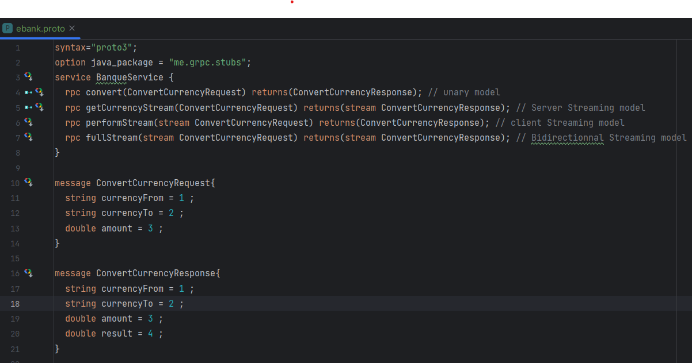

2. Then you use the protocol buffer compiler for your application's language to generate client and server code.  
Here i used a maven plugin to generate the code.

3. The server implements the service interface and runs a gRPC server to handle client calls.  
    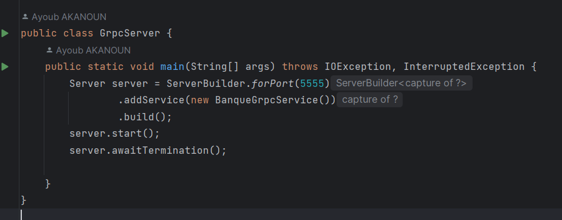

4. The client has a stub (referred to as just a client in some languages) that provides the same methods as the server.

5. The client calls the stub and the server calls the corresponding method implementation to handle the call.  

we can also use some tools to test the service provided like BloomRPC :  
***Tests:***
* covert methode:
    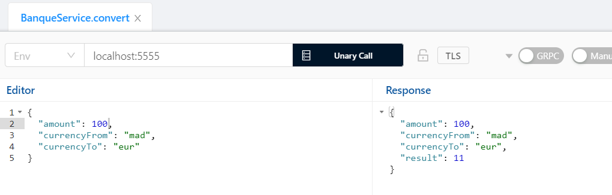  
* getAccount methode:
    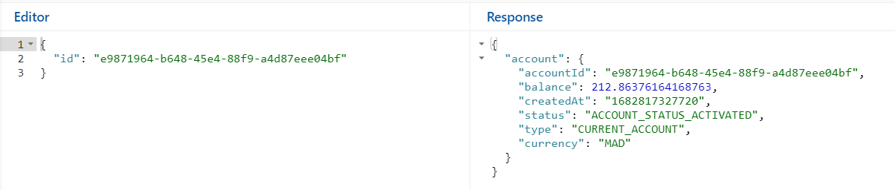
* getListAccount:
    
* getStreamOfAccountTransactions:
    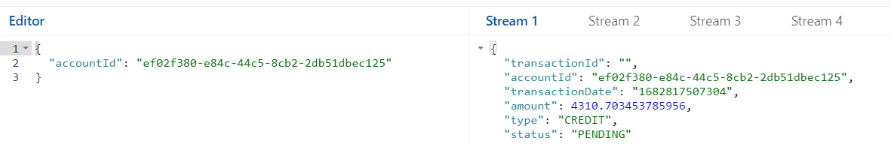

## Part 2:

**The second part contains an implementation of an chat server using java and two chat server clients ([`java`](grpc_partie2/src/main/java/me/grpc/client/ChatClient.java),[`python`](clientChatPython) )**

***Tests :***
* using BloomRPC :
    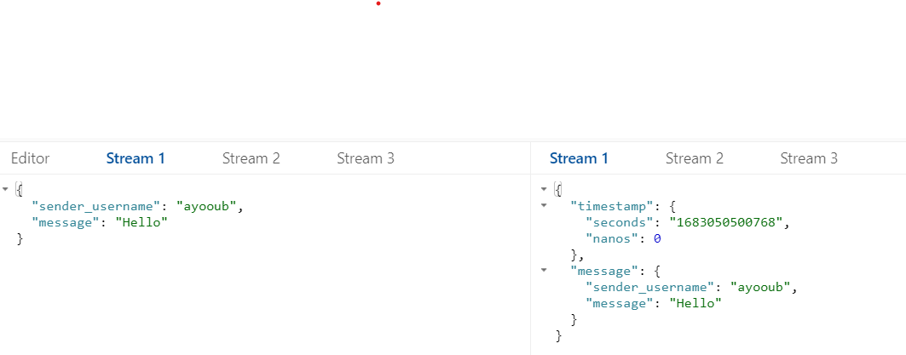  
    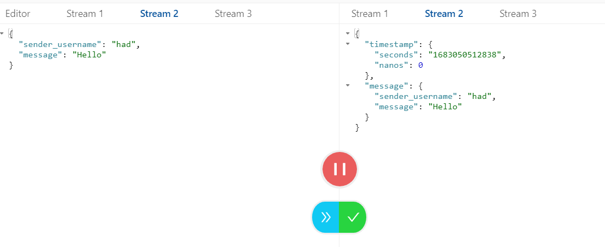  

* using java client :  

    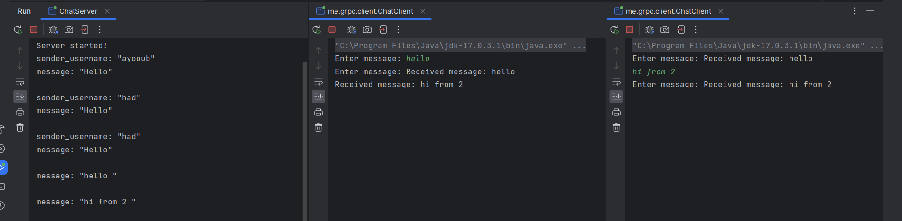

* using python client :

## Part 3:

**The third part contains a server game.at starts the server select randomlly a number between 1 and 1000 than the grpc clients try to find the number selected**

***Tests :***

* game server :
    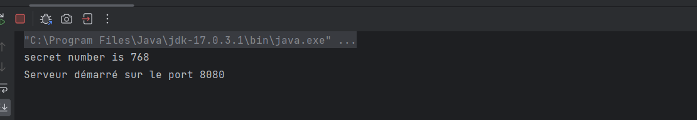
* bloomrpc client first try : 
    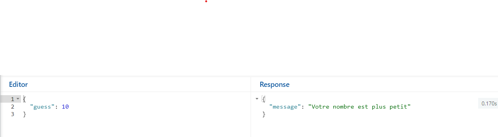
* bloomrpc client second try :  
    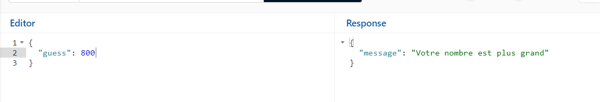
* bloomrpc client first try :  
    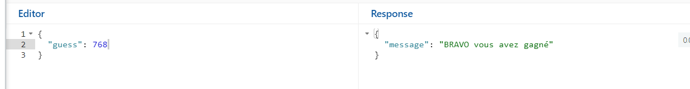

